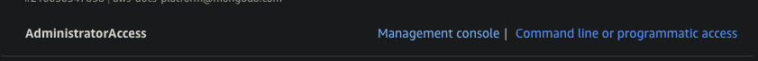
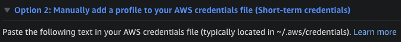
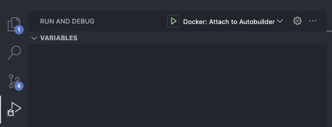

# Docs Worker Pool

As part of the Docs Tools Next Generation Project, the Docs Worker Pool seeks to make the build process for developers  
both easier and more scalable for developers.

The Docs Worker Pool operates on ECS Fargate. The serverless framework and cloudformation are used to automate
infrastructure provisioning and management. Going forward, any new buckets should be specified in
`infrastructure/ecs-main/buckets.yml`

For specific documentation on the Enhanced Autobuilder, Please visit the [cdk-infra/README.md](cdk-infra/README.md) file.

## To Add new properties

All our properties are managed in parameter store and pulled by serverless framework during deploy time and pushed into the Task environment as part of task definition.

To add a new property:

- Add property to parameter store for all environments (`stg`/`prd`) by following the convention as other properties
- Go to `infrastructure/ecs-main/serverless.yml` `custom` section
- Define the variable pointing to the right parameter store path
- Go to `infrastructure/ecs-main/ecs-service.yml` `TaskDefinition` section
- Add the new property to the `ContainerDefinitions`/`Environment` section

## Debug the Autobuilder for Local Testing

### Setting up

To debug the Autobuilder for local testing, you first need to ensure the following has been done:

1. Docker is running
2. AWS cli is installed and configured
3. The `~/.aws/credentials` file contains unexpired credentials for the `default` profile

If you do not have the AWS cli installed, install and configure it in your home directory:

`brew install awscli`

`aws configure`

You will be prompted to enter values for several fields, populate at least one of them(it doesn't matter which or what it is populated with, it will be changed). After this, you should have and be able to access a file with the path `~/.aws/credentials`.

For retrieving correct credentials, head to AWS console, and under `Docs Platform`, click on `Command line or programmatic access`.


Copy the value in option 2, `Manually add a profile to your AWS credentials file (Short-term credentials)`.



Paste this value in `~/.aws/credentials`, and replace the randomly generated profile (which looks something like `[123456789_AdministratorAccess]`) with `[default]`.
You should now have the correct credentials to run the debugger.

_**NOTE: credentials expire pretty quickly. Not sure how exactly how long they last for, but in my experience they expire in approximately 30 minutes.**_

You should now be all set to run the debugger command:

`npm run debug`

To view all of the options for the command, you can run:

`npm run debug -- --help`

Here is an example of running the local debugger for `cloud-docs`:

`npm run debug -- -o 10gen -n cloud-docs`

Here is an example of running the local debugger for `docs-monorepo/docs-landing` on branch `groot`:

`npm run debug -- -o 10gen -n docs-monorepo -d docs-landing -b groot`

By default, the environment that is used for the local Autobuilder is `stg`.

### Debugger Behavior

When the command is run, there are several steps that occur before the Autobuilder begins:

1. Environment variables and other information are pulled from Parameter Store
2. The GitHub repository is queried for data to create the job
3. The container is built
   - NOTE: If you have not run the debug command before, the build will take a substantial amount of time (approximately 10-15 minutes).
     Subsequent builds will be much shorter, especially if the changes are just code changes. If just a code change is made after the initial build, it should only take a few seconds for the build to complete and the container to run. Changes such as updating the version of the Snooty Parser, or the Redoc CLI will cause the builds to take much longer, but these happen much less frequently. The majority of the build should be on the order of a few seconds.
4. The data from step 2 is then added as a record in the `pool_test.queue`.
5. The container is then run, and waits for the user to connect to it via the VSCode debugger.

Once the container starts successfully, you should see something like the following message:

`Debugger listening on ws://0.0.0.0:9229/....`

To connect, click on the debug tab on the left side of your VSCode editor. Make sure the dropdown to the right of the green play button is set to the `Docker: Attach to Autobuilder` configuration. Press the green play button, and you will attach to the container.

### Troubleshooting

The most frequent cause of build failures will be related to expired AWS credentials, or not having Docker running. Also, if you haven't run `npm ci` in a while, you will need to do so as a new dependency was added to run the command.

Occasionally, errors may occur inexplicably, and the error messages may seem unrelated to any change made. Oftentimes, running the following commands can resolve these sporadic issues:

```sh
docker image prune
docker container prune
```

Also, another potential error could be due to the Dockerfile.local not being updated. If you are not seeing changes that are occurring in the Autobuilder in another environment, this may be why. For example, the Dockerfile.local could be using an older version of the Snooty Parser.



By default, the container will break at the first line of code, which will be in a file called `bind.js`. Press the fast-forward button to continue the execution. You are also able to add other breakpoints to stop the application. Once the application is complete, press `CTRL + C` for the terminal to exit out of the connection to the container.

If you receive `CredentialsProviderError: Could not load credentials from any providers`, make sure that there is no env `AWS_PROFILE` defined as a different profile anywhere (such as in the global `~/.zshrc` file). Otherwise, ensure that `AWS_PROFILE` matches the same profile defined in `~/.aws/credentials`.

## Run Tests

```
cd worker
npm install --dev
npm test  // runs ~ jest --detectOpenHandles --coverage
```

## Run Linter

```
cd worker
npm install --dev
npm run lint
```

See the [spec doc](https://docs.google.com/document/d/1XZOuuGmozcLQRSDitx0UWhZzJaS4opR1JVwZqDp-N4g/edit?usp=sharing) for more details.

## Branches

Development in this repository can be done via forks or branches. Currently, we support a `main` branch and `meta` branch. In general, the development workflow is to open pull requests against `main`, and to test `main` prior to creating new tags for a release.

In general, the git workflow within this repository loosely follows https://www.atlassian.com/git/tutorials/comparing-workflows/gitflow-workflow .

### Meta

`meta` contains various makefiles and .yaml files used for configuration.
Changes or additions to/of makefiles and .yaml for publishing purposes should be performed against this branch.
There is no general requirement to keep `meta` up to date with `main` or `integration`.

### Main

`main` is treated as a running pre-production feature branch. Changes should not go into main until properly tested for regressions in an acceptance environment. It is an expectation that hotfixes may have to occur on occasion - on such an occasion, a feature branch should be made from the commit hash of the last release tag, and not from the head of main. Main may contain changes that have yet to be fully tested for a production release.

### Release Tags

Each release tag represents a presumptive stable release - with the most recent release tag representing the current state of our production environment.

## Release Process

docs-worker-pool contains various triggers for release to higher environments. Currently, the repository supports an integration environment (reflecting the state of the main branch) and a production environment (reflecting the state of the most recent release tag).

### Integration Environment

- Merge a pull request or otherwise push a commit to `main` branch.
- Verify that the deploy-integration-ec2 workflow has executed successfully.

### Production Environment

- Create release tags. We currently follow [semver](https://semver.org/) standards.
- If you don't have push access, open an issue or otherwise contact a contributor with administrator privileges.
- Create a release associated with the tag using the GitHub UI or by running `gh release create`.
- Verify that the deploy-production-ec2 workflow executed successfully for both job runs across both production instances. The workflow should only run when a release is published.

### Serverless Development

#### Documentation

- [getting started][serverless]

#### Installation

```shell
npm install -g serverless
```

#### AWS Config

The serverless framework looks for credentials in `~/.aws/credentials`. So we need to set a profile there in addition to
`aws sso login`.

```text
[docs-sls-admin]
aws_access_key_id=REDACTED
aws_secret_access_key=REDACTED
```

#### Deploy Single Function

```shell
sls deploy function --stage dev --function {FunctionName}
```

[serverless]: https://www.serverless.com/framework/docs/getting-started
[snooty-frontend]: https://github.com/mongodb/snooty
