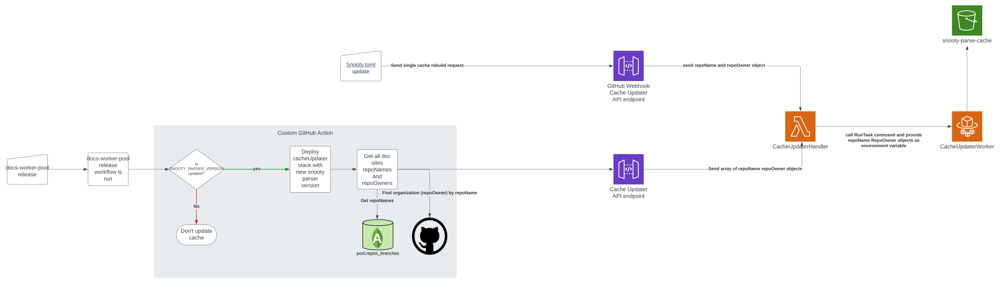

# Cache Update Worker

This directory contains the code for the cache update worker. The cache update worker rebuilds Snooty cache files and uploads them to the `snooty-parse-cache` S3 bucket whenever a cache invalidation event occurs.

A cache invalidation event occurs under two circumstances:

1. A doc site's `snooty.toml` file is changed; in this case, only the individual doc site's cache is rebuilt

2. An updated version of the Snooty Parser is used by the Autobuilder; all doc sites' Snooty caches will be rebuilt in this event

### Architecture

#### Worker

The cache update worker is an ephemeral ECS task that is spun up in response to a cache invalidation event. The doc sites that need to be rebuilt will be provided as an environment variable called `REPOS`. This is an array of objects that contain the `repoOwner` and `repoName` properties. The task is capable of processing multiple uploads concurrently. The code defined for it can be found in `src/cache-updater.ts`.

The infrastructure defined for the worker is defined [here](../../cdk-infra/lib/constructs/cache-updater/cache-updater-worker-construct.ts).

#### API

The cache updater has two endpoints to handle requests to rebuild caches. One handles individual doc site requests via a GitHub webhook push event, while the other handles requests from the [custom GitHub Action for releases](https://github.com/mongodb/docs-worker-actions/blob/2dfaefe5785bad73e2e9239e80318759868751d0/src/rebuild-parse-cache/index.ts#L30). The reason there are two separate endpoints stem from security reasons. We need to use the custom GitHub action for the release process as it must first deploy the changes to the cache updater stack, and then send a request. Because of this, we can't use a GitHub webhook push event because the event would be sent before the cache updater stack has been updated.

Because of this, the authentication process will be different. GitHub webhook requests have specific headers that are generated by the request (specifically, the `X-Hub-Signature-256`), that is required for authentication. So, the only difference between the two endpoints is how they are authenticated. The endpoint for the custom GitHub Action uses an API key that API Gateway generates. This ensures that the URL cannot be used publicly.

#### Diagram outlining the cache update process

